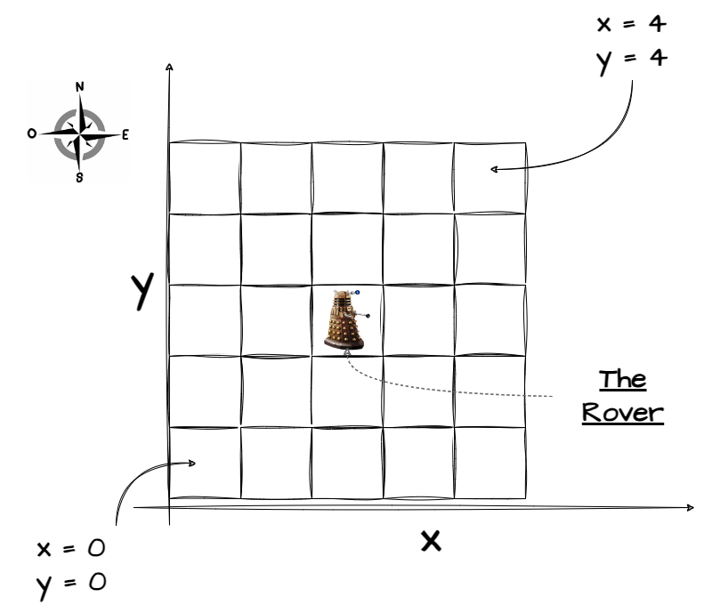

# README - Implémentation de Mauvaise Qualité du Kata Mars Rover

## Introduction

Ce projet présente une implémentation délibérément de mauvaise qualité du kata **Mars Rover**.
Le but de cette implémentation est d'illustrer les erreurs courantes et les pratiques à éviter lors du développement de
logiciels.
Ce README fournit un aperçu des fonctionnalités, des problèmes identifiés et des suggestions d'amélioration.

## Description du Kata

Le kata Mars Rover consiste à simuler le mouvement d'un rover sur la surface de Mars. Le rover peut se déplacer dans
quatre directions (nord, sud, est, ouest) et doit être capable de recevoir des instructions pour se déplacer et tourner.
Le terrain est limité par une grille définie, et le rover ne doit pas sortir de cette grille.

## Fonctionnalités

- **Mouvement** : Le rover peut se déplacer en avançant
- **Rotation** : Le rover peut tourner à gauche ou à droite.
- **Gestion des instructions** : Le rover peut recevoir une série d'instructions pour exécuter des mouvements.

Ci-dessous la représentation de la planète sous forme de grille:

## Problèmes Identifiés

### 1. Code Mal Organisé

Le code est structuré de manière désordonnée, rendant difficile la compréhension et la maintenance. 

### 2. Nommage Inapproprié

Le nommage est quelques fois vague et peu descriptif, ce qui complique la lecture du code.

### 3. Tests Unitaires de Mauvaise Qualité

Des tests unitaires sont présents mais leur faible qualité rend difficile la validation du comportement du rover.

### 4. Gestion des Erreurs Insuffisante

Le code ne gère pas correctement les erreurs potentielles, comme les instructions invalides ou les mouvements hors
limites.

## Suggestions d'Amélioration

### 1. Refactoriser le Code

Réorganiser le code en suivant les principes SOLID pour améliorer la lisibilité et la maintenabilité.

### 2. Améliorer le Nommage

Utiliser des noms explicites pour les variables et les fonctions afin de clarifier leur rôle.

### 3. Ajouter des Tests Unitaires

Mettre en place une suite de tests unitaires pour garantir que chaque fonctionnalité fonctionne comme prévu.

### 4. Renforcer la Gestion des Erreurs

Implémenter une gestion robuste des erreurs pour traiter les cas d'instructions invalides ou de mouvements hors limites.

## Conclusion

Cette implémentation du kata Mars Rover sert d'exemple sur ce qu'il ne faut pas faire lors du développement logiciel. En
identifiant ces problèmes et en proposant des solutions, nous pouvons améliorer nos compétences en programmation et
créer des applications plus robustes et maintenables.

---
